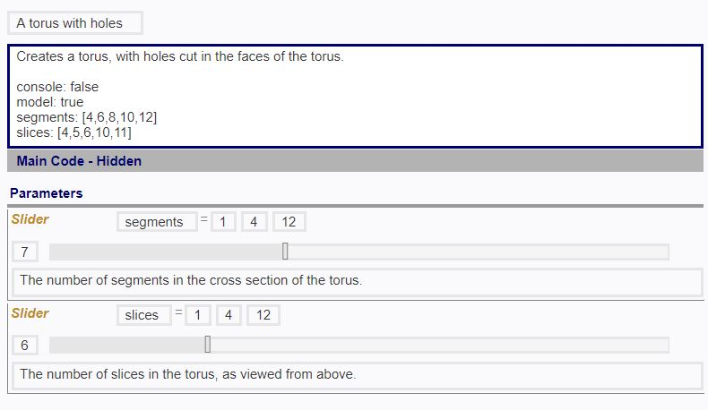

# Answer file structure
The mob file description can have extra parameters:

```
Text_description_of_the_file (optional, any existing text in the flowchart description would not interfere with 
                              the detection of flowchart parameters)
console: false/true     (optional, indicating whether the console log is to be checked for grading, default to false)
model: false/true       (optional, indicating whether the model is to be checked for grading, default to true)
normalize: false/true   (optional, indicating whether the file is to be normalized during executing process, default to true)
param_name_1: [value1_1, value1_2, value1_3, value1_4, ...]
param_name_2: [value2_1, value2_2, value2_3, value2_4, ...]
param_name_3: [value3_1, value3_2, value3_3, value3_4, ...]
...
param_name_n: [valueN_1, valueN_2, valueN_3, valueN_4, ...]
```

For the param_name_x, the parameter name must exists within the start node for it to be registered. 
The length of the array for each parameter should be the number of test case the file has. for example:

```
num1: [2,3,4,5]
num2: [2,4,6,8]
num3: [1,1,2,2]
```

the example above indicates that the mob file has 3 parameters: num1, num2, num3. The test cases would be made from
combining the respective value in each of the parameter array: first values of each parameter form the first test case.
second values form the second test case and so on. In the example above, there are 4 set of test cases:
{num1: 2, num2: 2, num3: 1}, {num1: 3, num2: 4, num3: 1},{num1: 3, num2: 6, num3: 2} and {num1: 4, num2: 8, num3: 2}. 
So both the answer file and the student file would be run 4 times with each of those parameter sets and the results 
(either the console log or the model or both) are compared with one another for grading. 

In the event where there are mismatch number of values in the parameter arrays, the number of test cases would be the
minimum number of values in a parameter array. For example if the description would be like this:

```
num1: [2,3,4]
num2: [2,4,6,8]
num3: [1,1]
```

There would only be 2 test cases: {num1: 2, num2: 2, num3: 1} and {num1: 3, num2: 4, num3: 1}

If there's any other parameters in the answer file that is not indicated in the description, it will not be checked and
modified in the student file for executing. Reversely, if there's any extra parameters in the student file that are not
in the description, it will also not be identified and penalized.

# Full description example
```
Creates a torus, with holes cut in the faces of the torus.

console: false
model: true
segments: [4,6,8,10,12]
slices: [4,5,6,10,11]
```

